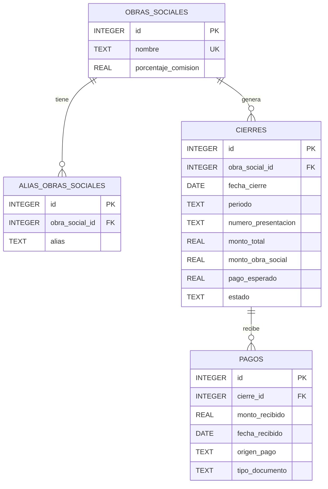

# Diagrama Entidad-Relación 

```mermaid 
erDiagram
    OBRAS_SOCIALES ||--o{ ALIAS_OBRAS_SOCIALES : "tiene"
    OBRAS_SOCIALES ||--o{ CIERRES : "genera"
    CIERRES ||--o{ PAGOS : "recibe"

    OBRAS_SOCIALES {
        INTEGER id PK
        TEXT nombre UK
        REAL porcentaje_comision
    }

    ALIAS_OBRAS_SOCIALES {
        INTEGER id PK
        INTEGER obra_social_id FK
        TEXT alias
    }

    CIERRES {
        INTEGER id PK
        INTEGER obra_social_id FK
        DATE fecha_cierre
        TEXT periodo
        TEXT numero_presentacion
        REAL monto_total
        REAL monto_obra_social
        REAL pago_esperado
        TEXT estado
    }

    PAGOS {
        INTEGER id PK
        INTEGER cierre_id FK
        REAL monto_recibido
        DATE fecha_recibido
        TEXT origen_pago
        TEXT tipo_documento
    }
```